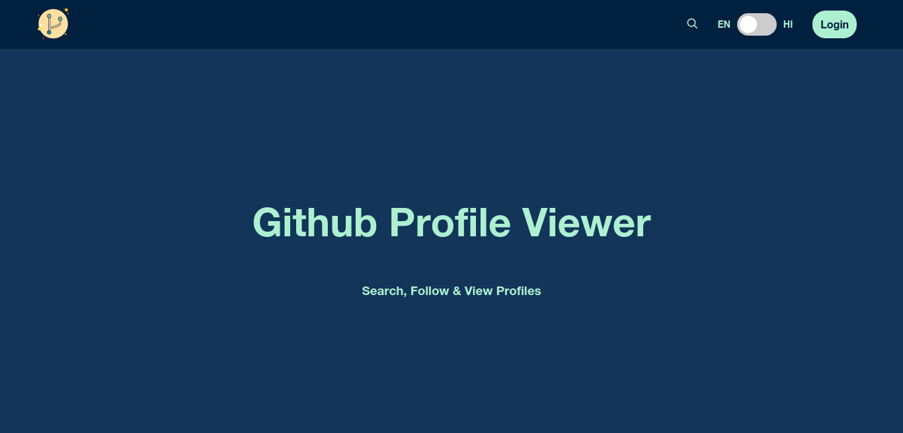
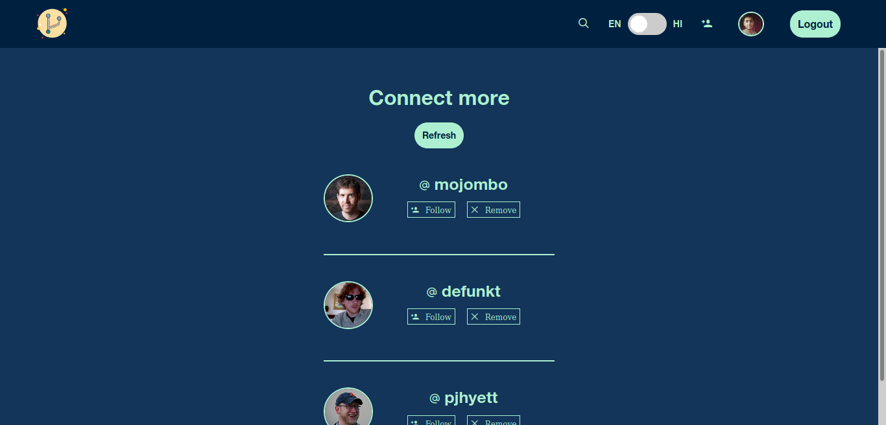
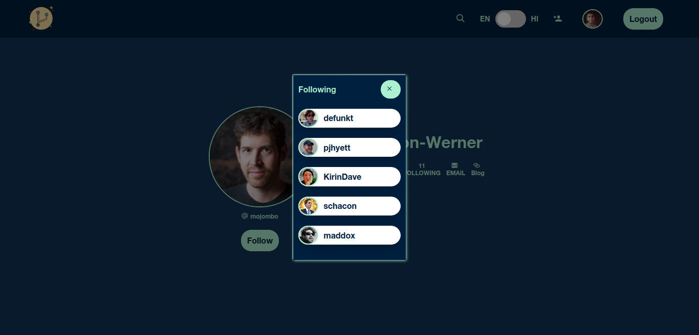
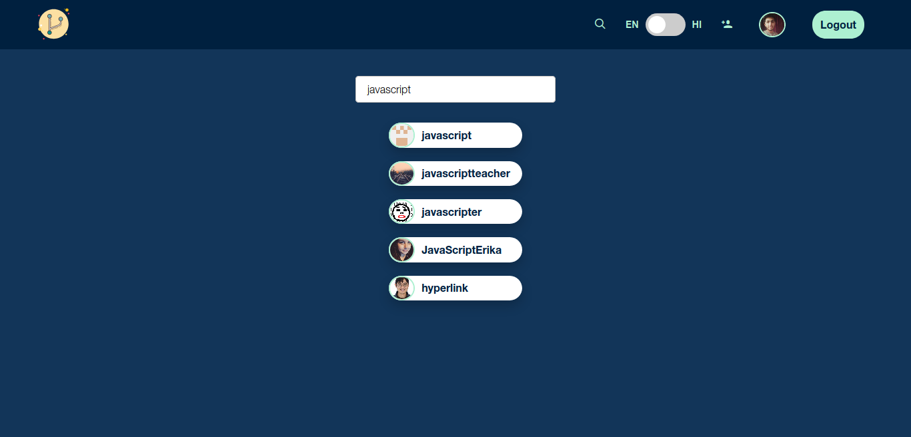

# Github Profile Viewer

### [Link](https://githubpv.netlify.app/) 🔗️

## Features✨️
- Search Github Profiles.
- Follow a real user on Github.
- Find people to connect with.
- View any profile.
- View followers and following of a profile.
- Localization in two language (EN | HI) using i18n.

## Details for Dev.💻️
- React Components with *Storybook*.
- Path alias setup with React-app-rewired.
- Eslint intalled.
- React + Redux + Presistent State using localstorage.
- Built using SASS.

## How to generate Token.🧙‍♂️️
- Generate a personal access toke from [here](https://github.com/settings/tokens).
- Allow user settings. 
- Copy the token and use it on login page.

## How to run 🏃️

1. `nvm use` - You must have nvm install on your system.
2. `npm install`
3. `npm start`

## How to build 🏗️ 
- `npm run build`

## Run Storybook 📖️
- `npm run storybook`

## Preview
- Connect

- Watch Profile & Followers

- Search

